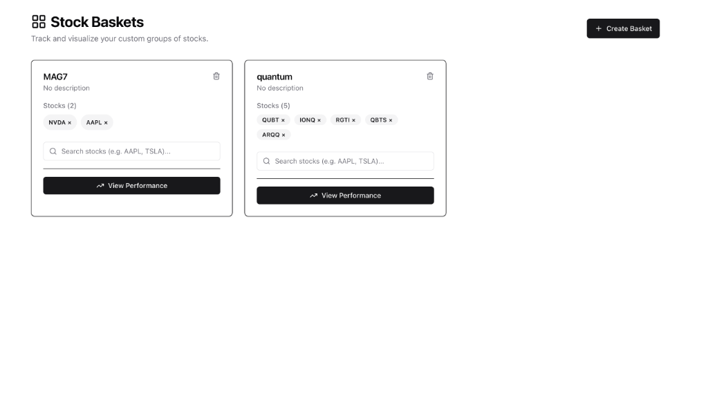
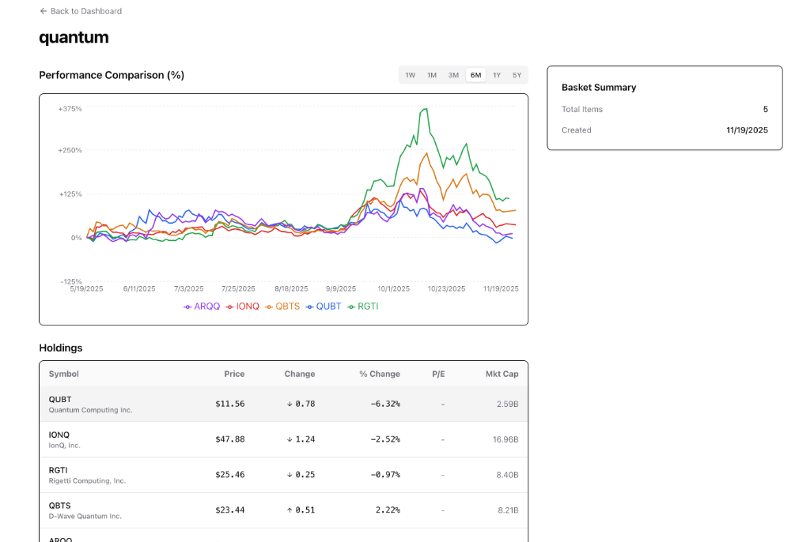

# Stock Basket App 📈

A modern web application to track, manage, and visualize custom baskets of stocks. Built with Next.js 15 and Tailwind CSS.



## Overview

Stock Basket App allows investors to group stocks into "baskets" (e.g., "Tech Giants", "Green Energy") and visualize their collective performance. It normalizes stock data to show percentage changes, enabling easy comparison between stocks of vastly different prices.

## Features

- **🧺 Basket Management**: Create custom groups of stocks with names and descriptions.
- **🔍 Smart Search**: Instantly search and add stocks using the Yahoo Finance API.
- **📊 Multi-Stock Visualization**: Compare performance of all stocks in a basket on a single, interactive chart.
  - **Percentage Change**: Normalized data (0% baseline) for fair comparison.
  - **Linear Interpolation**: Professional financial charting style.
- **📈 Key Metrics**: View real-time price, P/E ratios, market cap, and daily changes.
- **🌓 Premium Design**: Sleek UI with a dark-mode-first aesthetic using Tailwind CSS v4.



## Tech Stack

- **Framework**: [Next.js 15](https://nextjs.org/) (App Router)
- **Styling**: [Tailwind CSS v4](https://tailwindcss.com/)
- **Charts**: [Recharts](https://recharts.org/)
- **Data**: [Yahoo Finance 2](https://github.com/gadicc/node-yahoo-finance2)
- **Icons**: [Lucide React](https://lucide.dev/)

## Getting Started

### Prerequisites

- Node.js 18+
- npm or yarn

### Installation

1. Clone the repository:
   ```bash
   git clone https://github.com/stanleychris2/stockbasket.git
   cd stockbasket
   ```

2. Install dependencies:
   ```bash
   npm install
   ```

3. Run the development server:
   ```bash
   npm run dev
   ```

4. Open [http://localhost:3000](http://localhost:3000) in your browser.

## License

MIT
